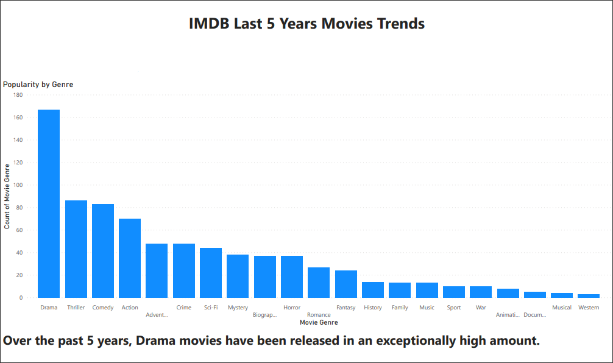
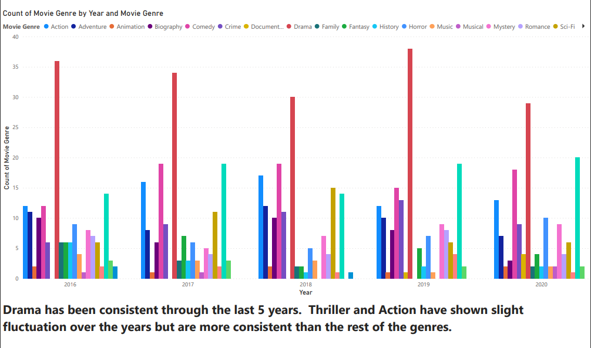
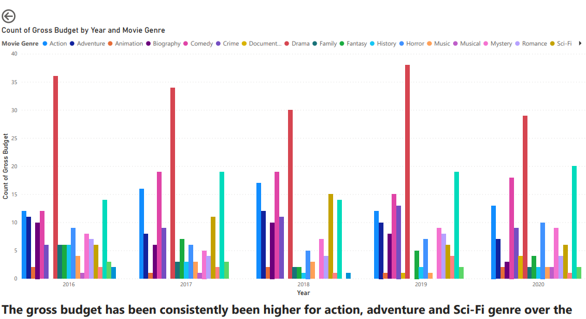
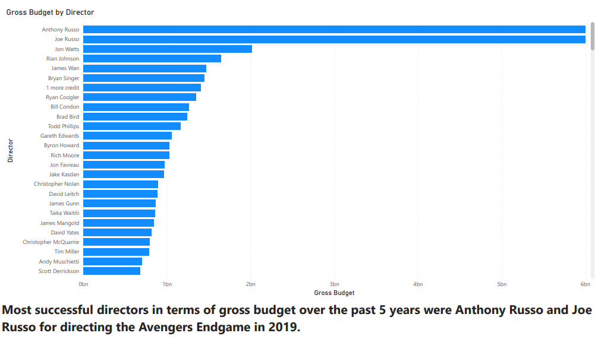
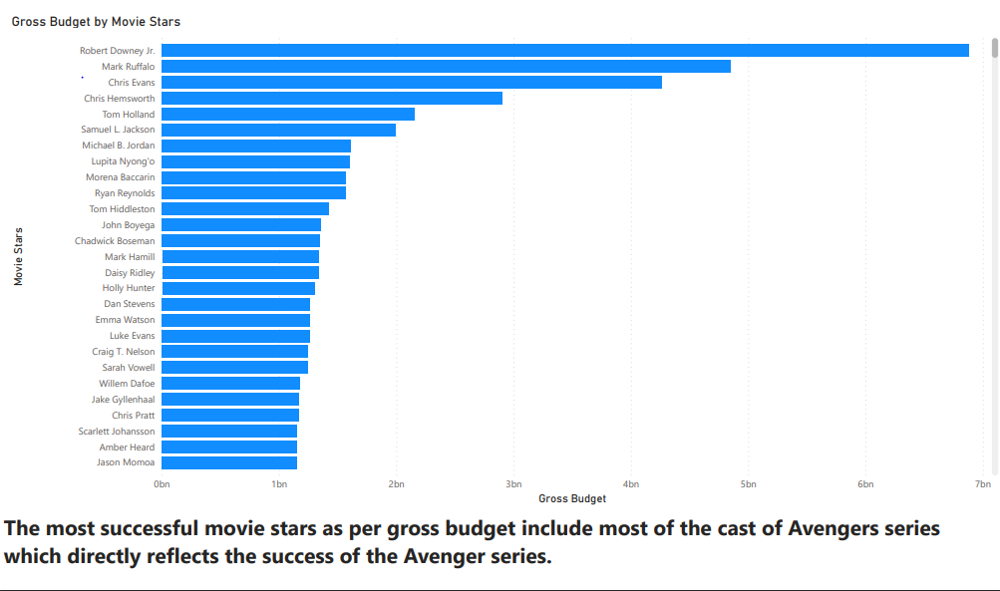
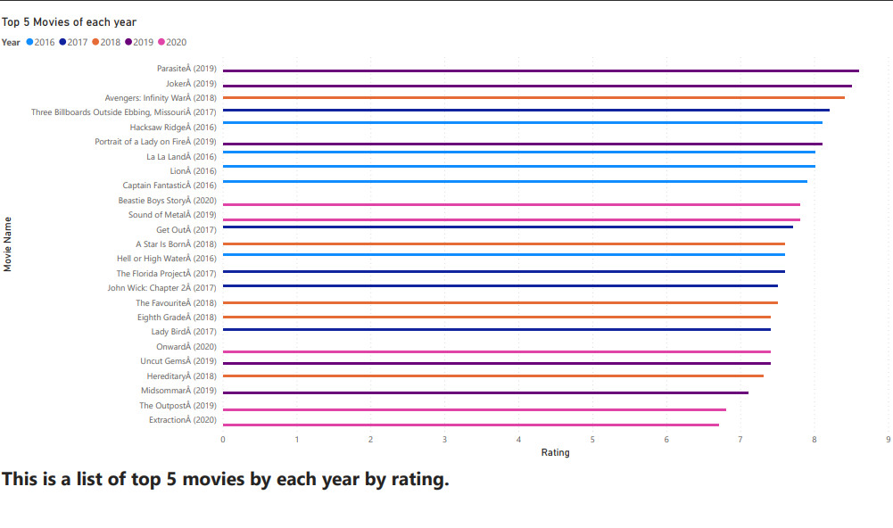

# IMDB MOVIE DATASET CRAWLER

This is part of an assignment for our Data Warehousing course. We're supposed to fetch details of movies from the last 5 years and find trends and perform analysis on the data.

Lastly, we were also required to create interactive reports and dashboards using PowerBI.

These are what we could find:

